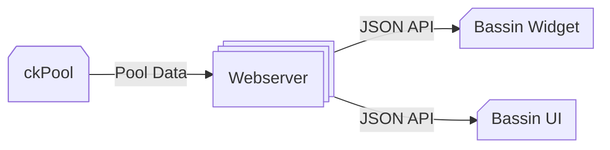

  
   
   
  A zero-fee Bitcoin solo mining pool for <a href="https://apps.umbrel.com/app/bassin">Umbrel</a>.
   
  Run your own ckPool at home.

> [!IMPORTANT]
> Due to security concerns, please update the app to version 2.1.0-hotfix.

### Install

1. Install `Bassin` directly from the [Umbrel App Store](https://apps.umbrel.com/app/bassin)
2. Open the `Bassin` app, then follow the on-screen instructions
3. Find the Bitcoin block 🎉

### Wiki

* [FAQ](https://github.com/duckaxe/bassin/wiki/FAQ)

### Repositories

* [Bassin UI](https://github.com/duckaxe/bassin-ui)
* [Bassin Widget](https://github.com/duckaxe/umbrel-bassin-widget)
* [Bassin @ Umbrel](https://github.com/getumbrel/umbrel-apps/tree/master/bassin)
* [ckPool Docker Image](https://ghcr.io/getumbrel/docker-ckpool-solo)

### Dataflow

### Thanks

A big shout out to the [Umbrel](https://umbrel.com) team for their fantastic support in creating and publishing the app.

### Legal

For academic and research purposes only.
